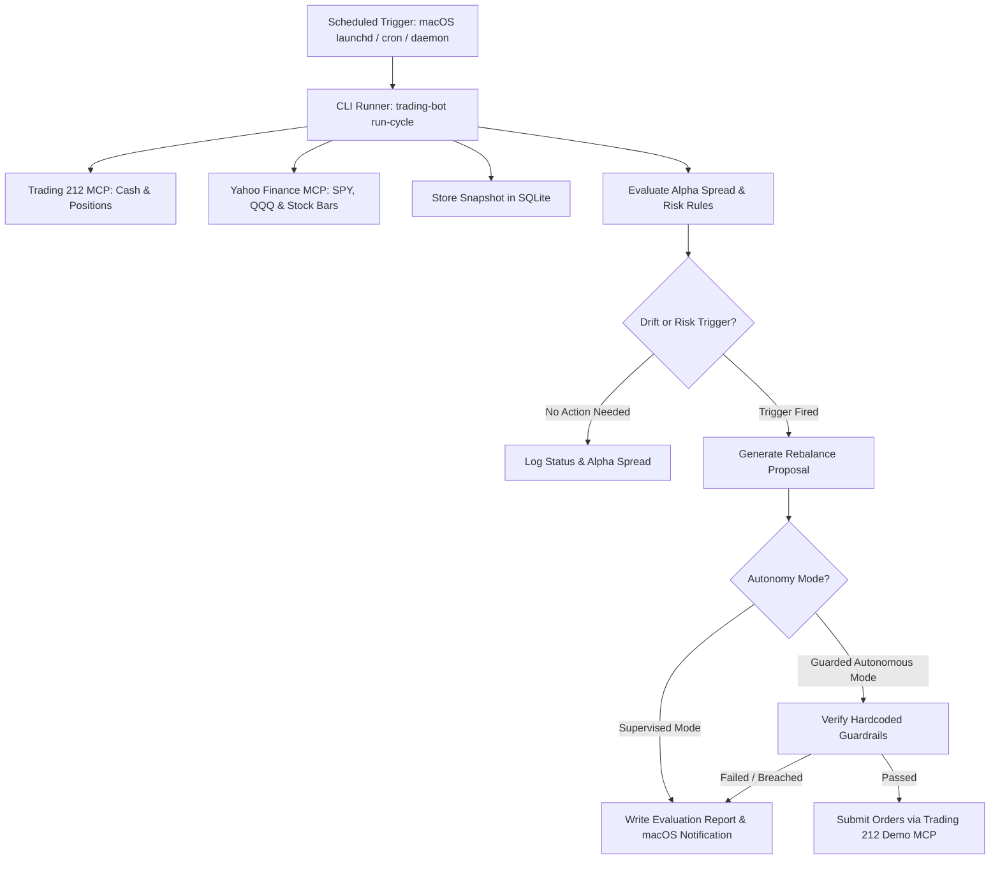

# Periodic Autonomy Architecture

To meet the 12-Month Alpha Challenge goals, the bot needs to periodically evaluate portfolio performance, track alpha against benchmarks, identify rebalance triggers, and execute adjustments to keep the portfolio on track.

---

## 1. How Periodic Autonomy Works



---

## 2. Scheduling Options on macOS

### Option A: Native macOS `launchd` Service (Recommended)
`launchd` is macOS's built-in service manager (similar to systemd on Linux). It runs reliably in the background, even when VS Code or the terminal is closed, and wakes up on schedule.

* **Schedule**: Every trading day (Monday–Friday) at **21:15 UK time / 16:15 EST** (15 minutes after US market close).
* **Location**: `~/Library/LaunchAgents/com.tradingbot.portfolio-monitor.plist`
* **Command Executed**: `uv run --directory /Users/carlos/Documents/Investment/Bot trading-bot run-cycle`

### Option B: Crontab
For traditional unix scheduling:
```bash
# Run at 21:15 UK time Monday through Friday
15 21 * * 1-5 cd /Users/carlos/Documents/Investment/Bot && uv run trading-bot run-cycle >> /Users/carlos/Documents/Investment/Bot/data/runner.log 2>&1
```

### Option C: Python Background Daemon Loop
Runs as a continuous background process with an hourly sleep cycle during trading hours:
```bash
uv run trading-bot daemon --interval 3600
```

---

## 3. Autonomy Execution Modes

### Mode 1: Supervised Autonomy (Default)
1. At market close, the runner executes `run-cycle`.
2. Gathers positions, computes alpha spread vs `SPY` and `QQQ`.
3. If an asset exceeds 25% or triggers a stop-loss, it writes a structured proposal to `data/pending_orders.json` and `data/latest_evaluation.md`.
4. Sends a desktop notification to macOS:
   *"Trading 212 Bot: Rebalancing proposed (+0.8% alpha). Review in VS Code."*
5. The user reviews and types `"Confirm"` in chat or CLI to fire the orders.

### Mode 2: Guarded Autonomous Mode (Trading 212 Demo Only)
To allow the bot to self-manage and rebalance fully automatically on the **Practice (Demo)** account:
1. Set `AUTONOMOUS_EXECUTION=true` in `.env`.
2. The bot is constrained by **Strict Hardcoded Circuit Breakers**:
   - **Demo Only Check**: Strictly fails and aborts if `ENVIRONMENT != demo`.
   - **Max Daily Turnover**: Maximum **£500** (~10% of portfolio) per day.
   - **Single Order Cap**: Maximum **£250** per order.
   - **Cash Floor**: Never executes buys if free cash would drop below **£250 (5%)**.
   - **Drawdown Circuit Breaker**: If total portfolio value drops $>5\%$ in any 24-hour period, all automated buying is halted until manual review.
   - **Audit Trail**: Every order and rebalance rationale is committed to `./data/portfolio.db` table `trade_audit_log`.
